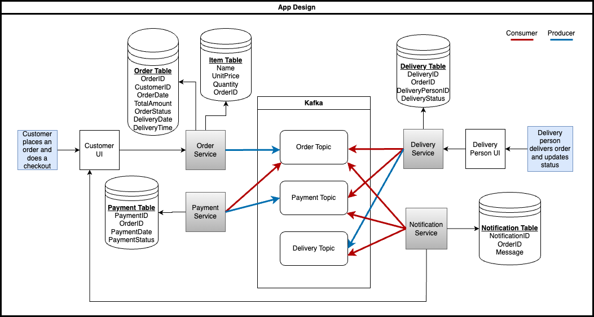

# Grocery Delivery App

## Overview
The **Grocery Delivery App**, written in **Go**, is a simple **microservices** application through which customers grocery orders can easily be processed and delivered to them on a given schedule.

The application has the following services:
- Order Service
- Payment Service
- Delivery Service
- Notification Service



It uses a **Postgres** database to store records and **Kafka** along with **Zookeeper** to keep track and process orders between services.

## Table of Contents
- Installation
- Kafka design
- How to run locally

## Installation

To run the application, **Docker** is required since each service has  `Dockerfile` and a `Postgres`, `Kafka` and `Zookeeper` Docker images are used. The `docker-compose.yml` handles pulling the images of the tools and also builds the services.

## Kafka Design

This part explains how each service talks to each other through `producers` and `consumers`.

### OrderService

As soon as an order is made by a customer (assuming through a UI), the UI sends a POST request to the `/orders` REST endpoint. The `OrderService` generates an `OrderID` and adds the grocery items to the `item` table and order to the `order` table along with the `OrderID`. The `OrderService` also `produce` a message to the `OrderCreatedTopic`.

### PaymentService

The `PaymentService` subscribes to the `OrderCreatedTopic` to `consume` new messages. The `PaymentService` is responsible for processing the payment, adding the record to the database and `produce` a new message to the `PaymentStatusTopic`.

### DeliveryService

The `DeliveryService` subscribes to the `OrderCreatedTopic` and the `PaymentStatusTopic` to `consume` new messages. From the `PaymentStatusTopic`, it checks if the payment is successful or unsuccessful and from the `OrderCreatedTopic`, it gets the delivery date and time which the customer selected. The `DeliveryService` is responsible for assigning the order to a person for delivery, as well as adding the record to the database and `produce` a message to the `DeliveryStatusTopic`.

### NotificationService

The `NotificationService` subscribes to the `OrderCreatedTopic`, `PaymentStatusTopic` and `DeliveryStatusTopic` and sends notifications to the user about their order being created, payment made and delivery schedule assigned and delivered.

## How to run locally

To run the app locally, use the following steps:

Use the `docker-compose.yml` to set up `postgres`, `kafka` and `zookeeper` by running the following command:

```
docker-compose up -d
```

To restart everything:

```
docker-compose up --build -d
```

To stop the services, use the following command:
```
docker-compose down
```
To restart all volumes, run:
```
docker volume rm $(docker volume ls -q)
```

Remove volumes to reset data:

```
docker-compose down -v 
```

To check if the containers are running, running the following command:
```
docker ps
```

In a new terminal, a CURL request can be sent to the `/orders` REST endpoint as below:

```curl
curl -X POST http://localhost:8080/orders \
  -H "Content-Type: application/json" \
  -d '{
    "CustomerID": 1,
    "Items": {
        "item1": {
            "Name": "item1", 
            "Quantity": 2,
            "UnitPrice": 3
        },
        "item2": {
            "Name": "item2",
            "Quantity": 3,
            "UnitPrice": 5
        }
    },
    "DeliveryDate": "2025-03-09",
    "DeliveryTime": "14:00"
  }'
```

To check if the records are saved to the database, connect to the docker container by running the following command:

```
docker exec -it grocery-delivery-app-postgres-1 psql -U postgres -d grocerydelivery
```

To find all tables run:
```
\dt
```

To query the tables, the below SQL statement can be executed:
- `SELECT * FROM items;`
- `SELECT * FROM orders;`
- `SELECT * FROM payments;`
- `SELECT * FROM deliveries;`
- `SELECT * FROM notifications;`

To see the messages in Kafka, connect to the Kafka container:
```
docker exec -it kafka /bin/bash
```

Once inside the Kafka container, use the kafka-console-consumer to see messages from a specific topic.
- `kafka-console-consumer.sh --bootstrap-server localhost:9092 --topic OrderCreated --from-beginning`
- `kafka-console-consumer.sh --bootstrap-server localhost:9092 --topic PaymentStatus --from-beginning`
- `kafka-console-consumer.sh --bootstrap-server localhost:9092 --topic DeliveryStatus --from-beginning`

To update the delivery status (assuming an order is delivered/failed), use the CURL command

```curl
curl -X POST http://localhost:8081/update-delivery \
  -H "Content-Type: application/json" \
  -d '{
    "DeliveryID": 1,
    "OrderID": 1,
    "DeliveryPersonID": 1,
    "DeliveryStatus": "delivered",
    "DeliveryDate": "2025-03-08",
    "DeliveryTime": "16:00"
  }'
```


## PROBLEMS:
- Check error "Fix Consumer error: kafka server: Request was for a topic or partition that does not exist on this broker"
- Check error "Payment was not successful for order 1 is in logs"

## TODO:
- Write test cases
- Better logging
- Dead Letter Queue for failed payments
- Central logging
- Use GraphQL instead of REST
- More kafka standards
- More features
- UI to send many (random) requests
- Analysis of each step
- Review images


list all Kafka topics
docker exec kafka kafka-topics.sh --list --bootstrap-server kafka:9092

TO LEARN:
- What is group and topic and how it works with multiple topics